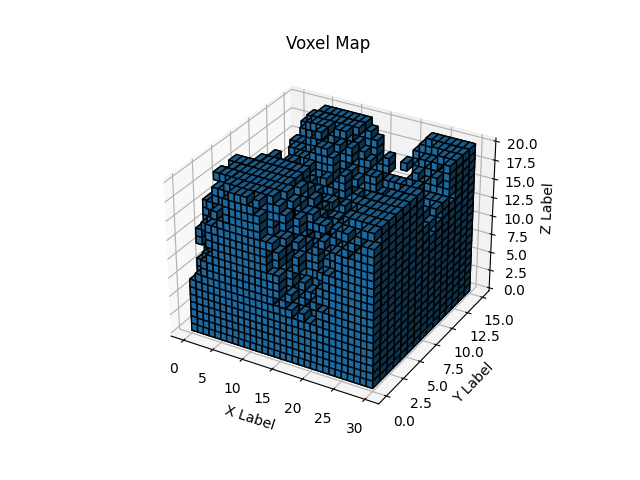
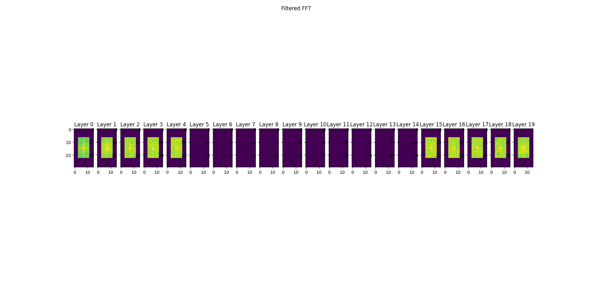
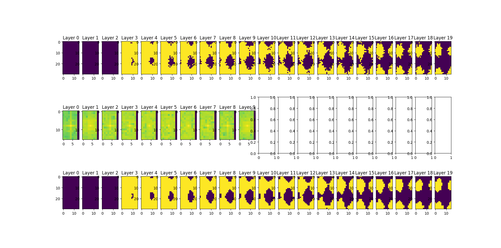
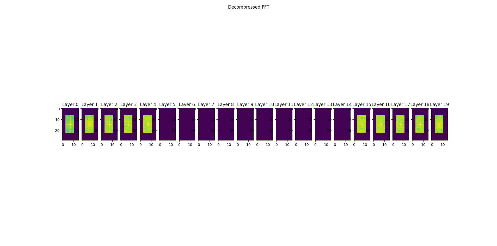
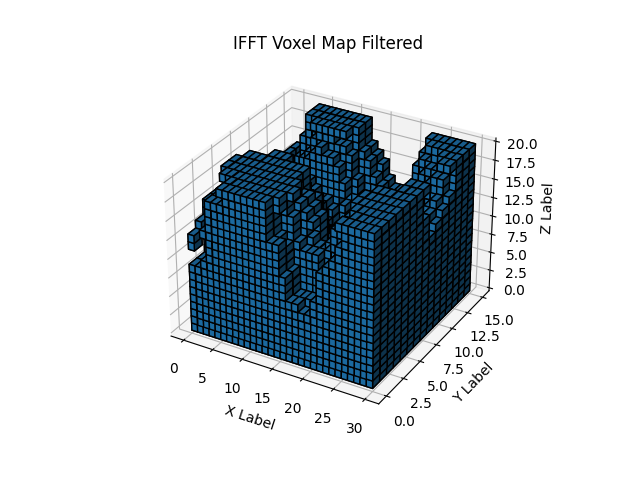
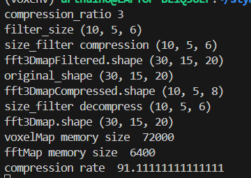
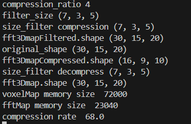

# stymphale_project

Project of drone swarm.

The purpose of this project is to test several algorithms, strategies and tools in the idea of creating a swarm of drones.

## Vox_drone

The purpose of the vox_drone module is to test the posibilities of using voxels instead of point cloud to represent the environment.
The voxels indeed allow to use Fast Fourrier Transform and apply a low pass filter on the environment.
Thanks to that, we can optains a representation of the environement with a very small memory footprint. That means we could possibly make the exange of the map between the drones faster or with a lower latency/communication frequency.

### Setup

```bash
source .config/setup.sh
```

### Run

```bash
python3 src/main.py
```

### Results











The final result depend of the compression. The compression is currently parameted by a compression ratio : ```filter_size = map_size/compression_ratio```




